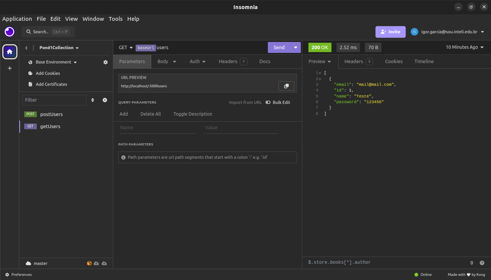

# User Management API

Esta é uma API simples para gerenciamento de usuários desenvolvida usando Flask.

## Funcionalidades

- Registro de usuários
- Login de usuários
- CRUD (Criar, Ler, Atualizar, Deletar) usuários

## Requisitos

- Python
- Docker

## Instalação e Execução

Siga as instruções para a instalação da API na sua máquina. Rode os seguintes comandos no diretório `Modulo10/pond1`

1. Instale as dependências:

   ```bash
   python3 -m pip install -r requirements.txt
   ```

2. Criação do Banco de Dados:

   ```bash
   python3 check1.py create_db
   ```

3. Execução da API:
 
   ```bash
   python3 -m flask --app check1 run
   ```

A aplicação estará disponível em http://localhost:5000

## Execução utilizando Docker

Para executar a aplicação utilizando o Docker, rode o seguinte comando no diretório `Modulo10/pond1`:
   
   ```bash
   sudo docker compose up
   ```

As API síncrona estará disponível em http://localhost:5000 enquanto a assíncrona em http://localhost:5001

## Documentação da API

A documentação da API pode ser encontrada [aqui](./swagger.yaml). Esta documentação fornece informações detalhadas sobre todas as rotas disponíveis, os parâmetros necessários e exemplos de uso.

## Testes de Rotas

Você pode interagir com a API usando qualquer cliente HTTP ou ferramenta de desenvolvimento de API. Aqui está um [exemplo](Insomnia.yaml) usando o insomnia para obter todos os usuários:

