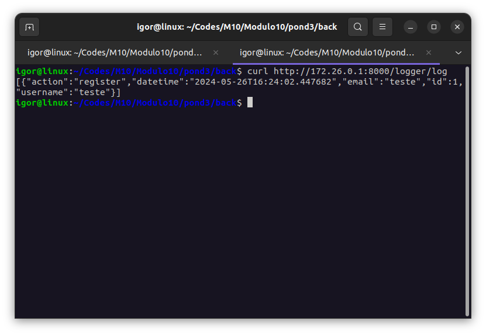

# IMG Processor APPI

Esta é uma aplicação de processamento de imagens em Flutter para dispositivos móveis.

## Pré-requisitos

Antes de começar a usar esta aplicação, verifique se o seguinte software está instalado em seu sistema:

- Flutter SDK: Você pode seguir as instruções de instalação no [site oficial do Flutter](https://flutter.dev/docs/get-started/install).
- Um dispositivo móvel ou um emulador para testar a aplicação.
- Docker

## Configuração

1. Para usar as funcionalidades do app, primeiro é necessário ativar o gateway no diretório `Modulo10/pond3/back`:

```bash
sudo docker compose up
```

2. Crie um arquivo .env no diretório `Modulo10/pond3/img_processor`:

```bash
URL        = 'http://<ip-gateway>:8000'
IMG_FILTER = 'img_filter'
LOGGER     = 'logger'
USER_MGMT  = 'user_mgmt'
```

3. Caso tenha um emulador para testar a aplicação, rode o comando:

```bash
flutter emulators --launch <device_name>
```

## Execução da Aplicação

Execute a aplicação no diretório `Modulo10/pond3/img_processor` com o comando:

```bash
flutter run
```

Isso iniciará a aplicação na sua máquina, dispositivo móvel ou emulador.

## IMG Processor APPI em Ação!

### Vídeo
Você pode conferir um vídeo do funcionamento do aplicativo clicando no link a seguir:

https://drive.google.com/file/d/15Qe4FKK5HWppMIRT0Ex_EZ8C4sQEgsCz/view?usp=sharing

### Log
Você pode conferir uma imagem do log de um login a seguir:


